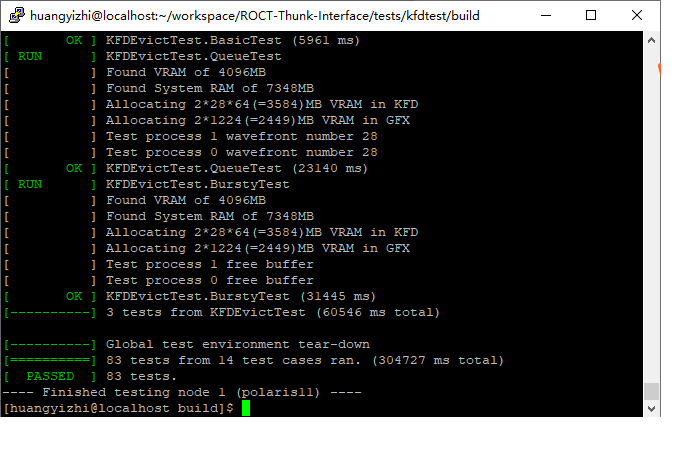
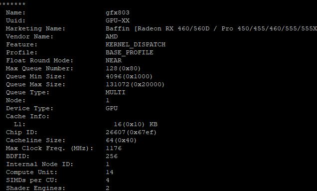
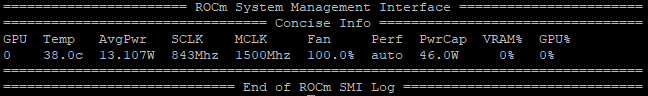
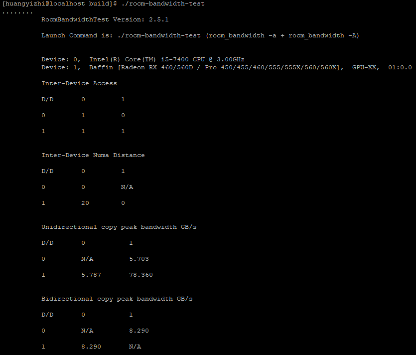
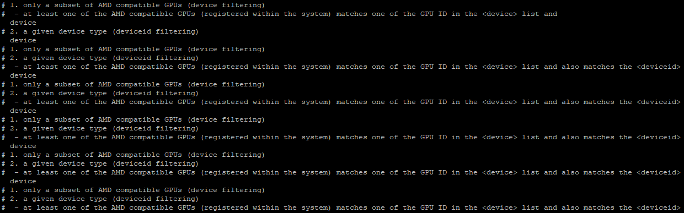

# Summer2021-No.36 将AMD ROCm开源软件栈逐步引入openEuler实现GPU加速计算

# 介绍
https://gitee.com/openeuler-competition/summer-2021/issues/I3EEN1
AMD ROCm™ 开放式生态系统是AMD为加速计算打造的开放式软件生态系统。它能帮助开发人员使用统一的编程框架对CPU/GPU进行开发。本项目旨在将AMD ROCm开源软件栈逐步引入openEuler实现GPU加速计算。目前，本项目主要支持最新的openEuler 21.03 x86_64版本、aarch 64版本和ROCm 4.2，已为openEuler引入ROCm运行环境、编译环境和部分应用程序库。

# 软件架构
ROCm由多个Project组成, 本项目逐步将这些Project引入到openEuler中，当前已引入了如下Project中的软件包：
## 1. ROCm Project

### ROCK-Kernel-Driver
ROCK-Kernel-Driver是由AMD开发的专门支持ROCm的Linux Kernel分支。事实上，可以使用up-stream Linux kernel。但是，在内核编译时，一定要选中AMD DRM Driver和HSA Driver。

### ROCT-Thunk-Interface 
ROCT-Thunk-Interface是ROC kernel driver的用户模式API接口。主要依赖DRM driver和KFD driver，并从用户层通过系统调用进入内核调用driver。  

### ROCR-Runtime
ROCR-Runtime是ROCm的运行时库。它包含了用户模式API接口。并提供支持Host端配置设备端计算核心进行HSA (Heterogeneous System Architecture) 计算所必须的软件库。当前支持的设备包括：  

CPU: Intel Haswell or newer, Core i5, Core i7, Xeon E3 v4 & v5; Xeon E5 v3;  
GPU: Fiji ASIC (AMD R9 Nano, R9 Fury and R9 Fury X); Polaris ASIC (AMD RX480); 

### rocminfo
ROCm的应用，用于报告HSA系统的信息，包括HSA系统属性，所支持的CPU、GPU设备信息等。

### rocm_smi_lib
rocm_smi_lib是ROCm系统管理接口库，它是一个Linux C库，为应用监控和管理GPU提供用户层接口。当前rocm-smi已经作为一个应用被移入rocm_smi_lib。

## 2. AMDGPU Compiler
### llvm-project
llvm-project是在up-stream llvm项目的基础上专门为AMD GPU开发的ROCm llvm-project分支，是HIP Project的基础。

### ROCm-Device-Libs
ROCm-Device-Libs是GPU设备的微码库。它是依赖llvm-project，并被一系列设备端语言运行时库依赖，主要有oclc*、ocml、ockl、opencl、hip、hc等。

### ROCm-CompilerSupport
ROCm-CompilerSupport是编译器支持库，提供各种编译器相关服务，是HIP的依赖库。

### rocm_bandwidth_test
rocm_bandwidth_test是测试内存拷贝和内核读写操作的基准测试程序。它支持多种数据大小的copy、write、read操作的测试。还可以根据内存池及其代理查询系统的拓扑结构。

## 3. HIP Project

### ROCclr
ROCclr 是一个虚拟设备接口，计算运行时与不同的后端（如 ROCr 或 PAL）交互。此抽象允许运行时在 Windows 和 Linux 上运行。 

### HIP
HIP 是一种 C++ 运行时 API 和内核语言，允许开发人员从单一源代码为 AMD 和 NVIDIA GPU 创建便携式应用程序。HIP提供HIPCC编译器用于编译HIP C++代码，类似于NVIDIA的NVCC编译器。HIP可以等效支持有限的CUDA API，并可以通过工具hipify-perl将CUDA代码转换为HIP代码。

## 4. ROCm Libraries
ROCm Libraries是ROCm提供的应用程序加速库。构建在HIP编程语言之上。 
### rocRand
rocRand是ROCm的随机数库。它是利用HIP语言实现，并运行ROCm runtime之上。它能够等效支持cuRand库的函数

### rocBlAS
rocBlAS是ROCm的线性代数库，它依赖rocRand。

以移植的ROCm Project和其中的软件包的对应依赖关系如图：

# 安装教程 X86
在x86下，几乎不需要修改任何代码，就可以把ROCm的软件包编译并移植进openEuler。本项目提供如下两种方式对相关软件包进行编译安装
## 1. 使用本项目提供的脚本自动下载、编译、安装
本项目提供完整的下载、编译、安装的自动化编译脚本，具体使用方法如下：
```
git clone https://gitlab.summer-ospp.ac.cn/summer2021/210010058 或者 
git clone https://gitee.com/openeuler-competition/summer2021-36
cd summer2021-36

//Step 1. 下载、编译、安装内核
./build_kernel.sh

//Step 2. 下载、编译、安装ROCm
./build.sh [option]

//不加选项时仅添加环境变量、安装下载工具和下载ROCm软件包
//具体选项特性如下：
      -h | --help                Print this help message
      -a | --all                 Build and install all rocm software (default)
      -d | --download            Download ROCm
      --roct                     Build and install ROCT-Thunk-Interface
      --llvm                     Build and install llvm-project
      --rocm_dev                 Build and install rocm_device-Libs
      --rocr                     Build and install ROCR-Runtime
      --rocm_cs                  Build and install ROCm-CompilerSupport
      --rocm_cmake               Build and install rocm_cmake
      --rocclr                   Build and install ROCclr
      --hip                      Build and install HIP
      --rocminfo                 Build and install rocminfo
      --rocm_smi                 Build and install rocm_smi_lib
      --rocm_bw                  Build and install rocm_bandwidth_test
      --rocrand                  Build and install rocRand
      --rocblas                  Build and install rocBLAS
      --rocmvs                   Build and install ROCmValidationSuite
      --arch                     Set specific architecture (X86 or aarch64, default x86_64)
      --gpu_arch                 Set specific gpu architecture (default gfx803)                      
      --prefix                   Set specific install path to ROCm
      -v | --rocm-version        Set specific rocm version to build
```

## 2. 自行下载软件包与分步编译
分步编译软件将分步展示本项目对软件包及其依赖软件进行的修改和编译、安装过程。
### openEuler内核编译
openEuler 21.03的默认内核并没有开启KFD，无法对ROCm提供驱动支持，因此，我们必须重新编译内核。openEuler内核可以按照1中同步本项目的kernel子模块获得，该模块fork自openEuler内核开源仓库。也可以从openEuler内核仓库获得，注意，由于kernel过大，建议使用ssh进行git clone。编译配置以及编译过程如下:

#### 安装依赖软件
```
sudo yum install gcc make ncurses-devel openssl automake openssl-devel
sudo yum install bc gcc-c++ kernel-devel pkg-config glibc bison flex elfutils-libelf-devel
```

#### 编译安装内核
```
git clone git@gitee.com:openeuler/kernel.git -b openEuler-21.03
cd kernel
make mrproper
cp arch/x86/configs/openeuler_defconfig .config
make menuconfig

Device Drivers-->
    Graphics support-->
        [M]AMD GPU-->
            [*]   Enable amdgpu support for SI parts
            [*]   Enable amdgpu support for CIK parts
            [*]   Enable amdgpu support for CIK parts
            [*]   Always enable userptr write support
            [*]   Allow GART access through debugfs
            [*]   HSA kernel driver for AMD GPU devices
保证以上内容全部被勾选（默认内核config并没勾选以上子内容），选好后进行内核编译和安装

make -j4
sudo make modules_install
sudo make install
```

### ROCm软件编译与安装
尽管ROCm软件按Project进行分组，但是，部分软件存在依赖关系，因此，按照以下步骤进行分步编译安装。建议在workspace中建立一个总体目录ROCm，将每个git下来的软件仓库都存在ROCm下。
### 0) 获取完整ROCm
```
mkdir -p ~/.bin/
curl https://storage.googleapis.com/git-repo-downloads/repo > ~/.bin/repo
chmod a+x ~/.bin/repo

mkdir -p ~/ROCm/
cd ~/ROCm/
~/.bin/repo init -u https://gitee.com/huangyizhitt/ROCm.git -b roc-4.2.x --repo-url=https://gerrit-googlesource.lug.ustc.edu.cn/git-repo
~/.bin/repo sync
```
本项目已经把ROCm仓库的地址重定向到github镜像https://github.com.cnpmjs.org/ 上，以加速整包下载速度。

### 1) ROCT-Thunk-Interface

#### 安装依赖软件
```
sudo yum install cmake numactl-devel rpm-build
```

#### 编译安装软件包
```
git clone https://github.com/RadeonOpenCompute/ROCT-Thunk-Interface.git -b rocm-4.2.0
cd ROCT-Thunk-Interface
mkdir build
cd build
cmake ..
make
sudo make install
sudo cp /opt/rocm/lib64/libhsakmt.so /opt/rocm/lib      //编译ROCmValidationSuite时，会从lib下找libhsakmt.so进行链接
```
默认会安装在/opt/rocm目录下（推荐），可以在cmake时用CMAKE_INSTALL_PREFIX定义自定义路径。
```
cmake -DCMAKE_INSTALL_PREFIX="自定义路径" ..
```

### 2) llvm-project
```
git clone git@github.com:RadeonOpenCompute/llvm-project.git -b rocm-4.2.0
cd llvm-project
mkdir build && cd build
cmake -DCMAKE_INSTALL_PREFIX=/opt/rocm/llvm -DCMAKE_BUILD_TYPE=Release -DLLVM_ENABLE_ASSERTIONS=1 -DLLVM_TARGETS_TO_BUILD="AMDGPU;X86" -DLLVM_ENABLE_PROJECTS="clang;lld;compiler-rt;libclc;libcxx;libcxxabi;openmp;parallel-libs" ../llvm
make
sudo make install
```
编译llvm会根据机器性能花费数小时时间。而且还可能遇到<font color="red">make collect2: ld terminated with signal 9</font>错误。该错误由swap分区太小所致（大概需要20GB左右），可以采用如下方法扩大swap分区：
```
cd /home
mkdir swap
cd swap
sudo dd if=/dev/zero of=swapfile bs=1M count=24567（24GB）
sudo mkswap swapfile
sudo swapon swapfile
```

### 3）ROCm-Device-Libs
```
git clone https://github.com/RadeonOpenCompute/ROCm-Device-Libs.git -b rocm-4.2.0
cd ROCm-Device-Libs
mkdir build && cd build
CC=/opt/rocm/llvm/bin/clang CXX=/opt/rocm/llvm/bin/clang++ cmake -DLLVM_DIR=/opt/rocm/llvm -DCMAKE_BUILD_TYPE=Release -DLLVM_ENABLE_WERROR=1 -DLLVM_ENABLE_ASSERTIONS=1 -DCMAKE_INSTALL_PREFIX=/opt/rocm ..
make
sudo make install
```

### 4）ROCR-Runtime
```
cd ROCR-Runtime/src
mkdir build
cd build
cmake -DCMAKE_INSTALL_PREFIX=/opt/rocm ..
make
sudo make install
```

### 5）ROCm-CompilerSupport
```
git clone https://github.com/RadeonOpenCompute/ROCm-CompilerSupport -b rocm-4.2.0
cd ROCm-CompilerSupport/lib/comgr
mkdir build && cd build
export LLVM_PROJECT=/opt/rocm/llvm
export DEVICE_LIBS=/opt/rocm
cmake -DCMAKE_BUILD_TYPE=Release -DCMAKE_INSTALL_PREFIX=/opt/rocm -DCMAKE_PREFIX_PATH="$LLVM_PROJECT;$DEVICE_LIBS" ..
make
sudo make install
```

### 6）rocm-cmake
```
git clone https://github.com/RadeonOpenCompute/rocm-cmake -b rocm-4.2.0
cd rocm-cmake
mkdir build
cd build
cmake ..
sudo cmake --build . --target install
```

### 7）ROCclr
#### 安装依赖
```
sudo yum install mesa-libGL-devel mesa-libGLU-devel
```
#### 编译安装软件
```
git clone https://github.com/ROCm-Developer-Tools/ROCclr -b rocm-4.2.0
git clone https://github.com/RadeonOpenCompute/ROCm-OpenCL-Runtime.git -b rocm-4.2.x

export ROCclr_DIR="$(readlink -f ROCclr)"
export OPENCL_DIR="$(readlink -f ROCm-OpenCL-Runtime)"

cd "$ROCclr_DIR"
mkdir -p build && cd build
cmake -DOPENCL_DIR="$OPENCL_DIR" -DCMAKE_PREFIX_PATH=/opt/rocm -DCMAKE_INSTALL_PREFIX=/opt/rocm/rocclr ..
make
sudo make install
```

### 8）HIP
```
git clone https://github.com/ROCm-Developer-Tools/HIP -b rocm-4.2.0
export HIP_DIR="$(readlink -f HIP)"
cd HIP
mkdir -p build && cd build
cmake -DCMAKE_PREFIX_PATH="$ROCclr_DIR/build;/opt/rocm/" -DCMAKE_INSTALL_PREFIX=/opt/rocm/hip -DHIP_COMPILER=clang ..
make
sudo make install
```
安装完成后，为了一劳永逸的解决--rocm-path问题，可以对hipcc编辑，为其添加为默认编译选项：
```
sudo /opt/rocm/hip/bin/hipcc
在文件中加入:
$HIPCXXFLAGS .= " --rocm-path=/opt/rocm";
$HIPCFLAGS .= " --rocm-path=/opt/rocm";
$HIPLDFLAGS .= " --rocm-path=/opt/rocm";
```

### 9）rocminfo
```
git clone https://github.com/RadeonOpenCompute/rocminfo.git
cd rocminfo
mkdir build
cd build
cmake -DCMAKE_PREFIX_PATH=/opt/rocm ..
make
```

#### 10）rocm_smi_lib
```
git clone https://github.com/RadeonOpenCompute/rocm_smi_lib.git -b rocm-4.2.0
cd rocm_smi_lib
mkdir build
cd build
cmake ..
make
sudo make install
```

### 11）rocm_bandwidth_test
```
git clone https://github.com/RadeonOpenCompute/rocm_bandwidth_test.git
cd rocm_bandwidth_test
mkdir build
cd build
cmake ..
make
```

### 12）rocRand
```
git clone https://github.com/ROCmSoftwarePlatform/rocRAND.git -b rocm-4.2.0
cd rocRAND
mkdir build && cd build
CXX=hipcc CXXFLAGS=--rocm-path=/opt/rocm cmake -DBUILD_BENCHMARK=ON -D AMDGPU_TARGETS=gfx803 -DCMAKE_INSTALL_PATH=/opt/rocm ..
make
sudo make install
```
注意：<font color="red">AMDGPU_TARGETS中应选取自己AMD GPU对应架构，不修改的话默认采用gfx900;gfx906;gfx908</font>

### 13）rocBLAS
rocBLAS的install.sh目前仅支持少数几个操作系统，<font color="red">必须使用本项目提供的install.sh</font>，或自行修改install.sh操作系统支持部分代码，才能在OpenEuler上进行编译安装。另外，rocBLAS依赖的rocm-cmake、Tensile、libmsgpack等软件包，在执行install.sh过程中，会自动从github上进行下载安装。如果连接github不顺利，我们建议手动安装rocm-cmake（6），然后使用本项目修改后的CMakeLists.txt文件。该文件将下载链接重定向到了gitee上，使用本项目fork的Tensile，另外还添加编译选项--rocm-path=/opt/rocm。具体编译安装方式如下，会经历相当长的一段编译时间：
```
// Install libboost and libmsgpack
sudo yum install boost-devel
git clone https://github.com/msgpack/msgpack-c.git
cd msgpack-c
git checkout c_master
cmake .
make
sudo make install

git checkout cpp_master
cmake -DMSGPACK_CXX11=ON .
make 
sudo make install


git clone https://github.com/ROCmSoftwarePlatform/rocBLAS.git -b rocm-4.2.0
cp summer2021-36/rocm/rocBLAS/install.sh rocBLAS/                       
cp summer2021-36/rocm/rocBLAS/CMakeLists.txt rocBLAS/
cd rocBLAS
./install.sh
sudo cp -rf build/release/rocblas-install/rocblas/include/* /opt/rocm/include
sudo cp -rf build/release/rocblas-install/rocblas/lib/* /opt/rocm/lib
```

### 14）ROCmValidationSuite
```
sudo yum install doxygen pciutils-devel
git clone https://github.com/ROCm-Developer-Tools/ROCmValidationSuite.git -b rocm-4.2.0
cp summer2021-36/rocm/ROCmValidationSuite/CMakeLists.txt ROCmValidationSuite/                       
cp summer2021-36/rocm/ROCmValidationSuite/CMakeYamlDownload.cmake ROCmValidationSuite/
cp summer2021-36/rocm/ROCmValidationSuite/CMakeGtestDownload.cmake ROCmValidationSuite/
cd ROCmValidationSuite
mv rvs/conf/deviceid.sh.in rvs/conf/deviceid.sh         
mkdir build
cmake -DROCM_PATH=/opt/rocm -DCMAKE_INSTALL_PREFIX=/opt/rocm -DCMAKE_PACKAGING_INSTALL_PREFIX=/opt/rocm ..
make
sudo make install
make package    //编译出rpm包
```

# 单元测试
用于测试软件包移植的正确性。单元测试均为官方单元测试。

## 1. ROCT单元测试
ROCT单元测试主要用于在用户层测试ROCm的驱动代码和ROCT代码。在test文件夹下有三大测试类，当前项目仅使用kfdtest，测试kfd驱动的正确性和接口代码的正确性。编译和使用方式如下：
```
sudo yum install libdrm-devel libdrm_amdgpu-devel libhsakmt-devel
cd ROCT-Thunk-Interface/test
mkdir build && cd build
cmake ..
make
./run_kfdtest.sh
```
共14个test cases，83个tests，测试成功如下图所示


## 2. rocm_smi_lib单元测试
rocm_smi_lib单元测试主要测试rocm_smi对GPU硬件的管理和信息获取，编译与使用如下
```
sudo ln -s /opt/rocm/rocm_smi/include/rocm_smi ./rocm_smi
cd rocm_smi_lib/tests/rocm_smi_test
mkdir build && cd build
cmake -DROCM_DIR=/opt/rocm ..
make
sudo ./rsmitst64
```
rocm_smi_lib单元测试主要测提供2个test cases，32个tests，本项目使用的GPU的测试如图


# 应用测试
ROCm应用程序的测试，验证应用程序的有效性

## 1. rocminfo
编译完成rocminfo后会在build目录下产生rocminfo的elf可执行文件。运行完，将会显示HSA信息（包括HSA、CPU、AMD GPU、ISA信息），具体如下图所示：


## 2. rocm_smi_lib
rocm_smi_lib提供一个定时GPU监控应用，rocm-smi（类似CUDA的nvidia-smi）。编译完成后，可以按如下方式执行
```
/opt/rocm/bin/rocm-smi
```
可以获取如图GPU信息


## 3. rocm_bandwidth_test
rocm_bandwidth_test提供一个测试CPU-GPU之间带宽的工具rocm-bandwidth-test。编译完成后再build目录下生成。
```
cd rocm_bandwidth_test/build
./rocm-bandwidth-test
```
可以获得CPU-CPU（numa），GPU-GPU，GPU-CPU，CPU-GPU之间的带宽，具体如图：


## 4. ROCmValidationSuite
ROCmValidationSuite编译完成后，会产生一个rvs全局测试脚本，会把全部功能测试一次，按如下执行
```
cd ROCmValidationSuite/build/bin
sudo ./rvsqa.new.sh
```
测试结果如下图所示：


#### 使用说明

1.  xxxx
2.  xxxx
3.  xxxx

#### 参与贡献

1.  Fork 本仓库
2.  新建 Feat_xxx 分支
3.  提交代码
4.  新建 Pull Request


#### 特技

1.  使用 Readme\_XXX.md 来支持不同的语言，例如 Readme\_en.md, Readme\_zh.md
2.  Gitee 官方博客 [blog.gitee.com](https://blog.gitee.com)
3.  你可以 [https://gitee.com/explore](https://gitee.com/explore) 这个地址来了解 Gitee 上的优秀开源项目
4.  [GVP](https://gitee.com/gvp) 全称是 Gitee 最有价值开源项目，是综合评定出的优秀开源项目
5.  Gitee 官方提供的使用手册 [https://gitee.com/help](https://gitee.com/help)
6.  Gitee 封面人物是一档用来展示 Gitee 会员风采的栏目 [https://gitee.com/gitee-stars/](https://gitee.com/gitee-stars/)
